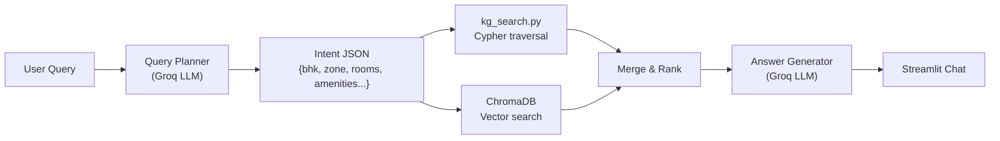
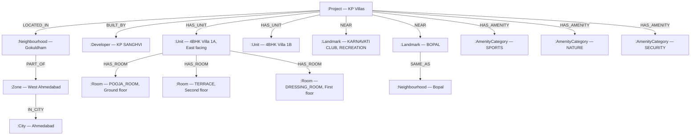
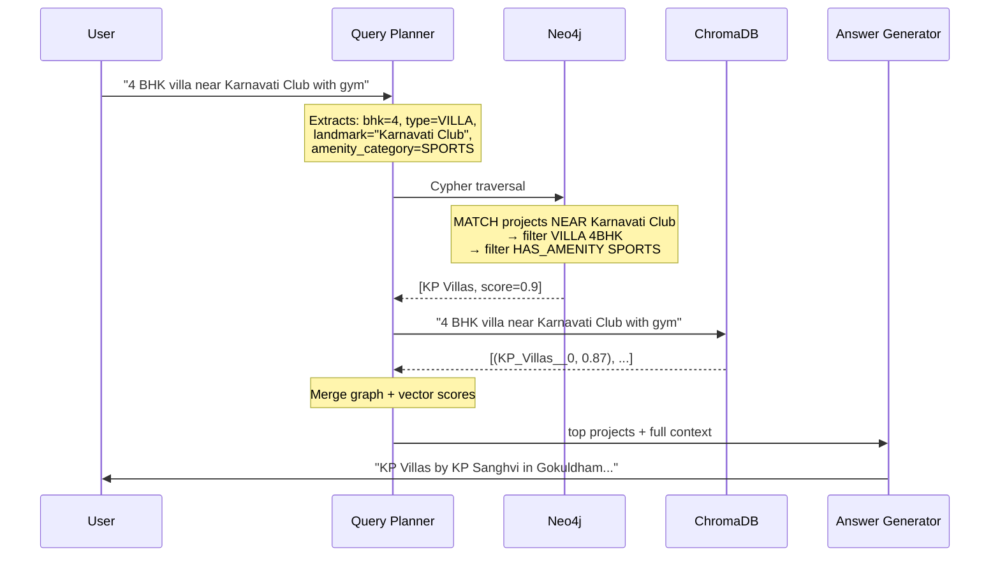

# RERA Chatbot — Knowledge Graph Implementation Plan

## Why a Knowledge Graph?

**Brochure data is already a graph.** A project has a developer, sits in a neighbourhood, belongs to a zone, has unit variants, each unit has rooms, each room has a type and dimensions. Landmarks physically exist near a project. Amenities are shared categories across many projects.

A Knowledge Graph keeps all of this structure intact — and queries it natively, through relationships rather than text matching.



---

## The Graph Model — Entities and Relationships

### What the brochure data looks like

Reading through the actual JSONs:
- **KP Villas** is a 4-BHK VILLA project in **Gokuldham**, near landmarks like *Karnavati Club*, *Bopal*, and *Fun Republic*, with 7 villa variants each having its own room layout across 3 floors
- **Svasaar Pravesh** is a 1–2 BHK APARTMENT project in **Gamdi Gaam / Vatva**, with 14 blocks, parks, and parking areas
- Landmarks are OCR-extracted text from brochure images — they can have typos, abbreviations, and inconsistent spelling
- Amenities range from brief notes (`has clubhouse`) to full descriptive sentences ("Jogging track amidst the exclusively landscaped COP")



### Node Types

| Node | Purpose | Key Properties |
|---|---|---|
| `:Project` | One brochure = one project | `project_id`, `project_name`, `developer_name`, `rera_number`, `project_status`, `possession_date`, `total_buildings` |
| `:Unit` | One unit variant (e.g. "Villa Serene 1A") | `unit_id`, `unit_type`, `property_type`, `bhk`, `entrance_facing`, `carpet_sqft`, `super_builtup_sqft`, `description` |
| `:Room` | An individual room inside a unit | `room_type`, `name`, `area_sqft`, `floor_level`, `attached_bathroom`, `has_balcony_access` |
| `:Neighbourhood` | A specific locality or area | `name` (normalised, e.g. "Bopal", "Vatva") |
| `:Zone` | A broad city zone | `name` (e.g. "West Ahmedabad", "East Ahmedabad") |
| `:City` | City | `name` (Ahmedabad, Surat, Rajkot…) |
| `:Developer` | Builder / developer company | `name` (normalised) |
| `:Landmark` | A real place mentioned near a project | `name`, `landmark_type` (EDUCATION / HEALTHCARE / COMMERCIAL / RELIGIOUS / TRANSPORT / RECREATION) |
| `:Amenity` | An individual amenity offered by a project | `name` — actual amenity name, e.g. "Swimming Pool", "Jogging Track", "Gymnasium", "Clubhouse" |

### Relationships

```
(Project)-[:LOCATED_IN]->(Neighbourhood)
(Neighbourhood)-[:PART_OF]->(Zone)
(Zone)-[:IN_CITY]->(City)
(Project)-[:IN_CITY]->(City)
(Project)-[:BUILT_BY]->(Developer)
(Project)-[:HAS_UNIT]->(Unit)
(Unit)-[:HAS_ROOM]->(Room)
(Project)-[:NEAR]->(Landmark)
(Landmark)-[:SAME_AS]->(Neighbourhood)       -- "BOPAL" landmark → Bopal neighbourhood
(Neighbourhood)-[:ALIAS_OF]->(Neighbourhood) -- "Vizol" → "Vinzol"
(Project)-[:HAS_AMENITY]->(Amenity)          -- individual named node, e.g. "Swimming Pool"
```

> **Why `:Amenity` as individual named nodes?**
> Each amenity is stored with its actual name — "Swimming Pool", "Jogging Track", "Gymnasium", "Children's Play Area". A user can search for any amenity by name and the graph matches it with partial string matching. "gym", "gymnasium", and "health club" all resolve to the Gymnasium node. No fixed category buckets — robust for any amenity a user might ask about.

> **Why `:Room` as a real node?**
> Rooms are facts, not flags. Storing `(:Room {room_type: "POOJA_ROOM"})` as a graph node means you can not only find units that have a pooja room, but also retrieve its dimensions, floor level, and bathroom attachment in the same traversal — with no precomputation or schema changes required.

---

## The 3-Stage Search Pipeline



### Stage 1 — Graph Traversal (`kg_search.py`)

The query planner produces an `Intent` object. The graph answers it by traversing relationships, not matching text:

```python
@dataclass
class Intent:
    city: str | None             # "Ahmedabad"
    zone: str | None             # "West Ahmedabad"
    area: str | None             # "Bopal" (specific neighbourhood)
    near_landmark: str | None    # "Karnavati Club"

    bhk: int | None
    min_bhk: int | None
    bhk_options: list[int]
    property_type: str | None    # APARTMENT / VILLA / ROW_HOUSE / TENEMENT / PENTHOUSE

    must_have_rooms: list[str]   # ["POOJA_ROOM", "STUDY_ROOM", "TERRACE"]
    amenity_categories: list[str]# ["SPORTS", "WELLNESS", "SECURITY"]

    min_sqft: float | None
    max_sqft: float | None
    entrance_facing: str | None

    query_type: str              # SEARCH / DETAIL / COMPARE / AGGREGATE
    project_name: str | None
    compare_projects: list[str]
    semantic_query: str          # Passed to ChromaDB
```

### Stage 2 — ChromaDB Vector Search (semantic layer)

ChromaDB handles the **descriptive / vibe** side of queries:
- "spacious 4 BHK villa with good ventilation and terrace garden"
- "affordable 1 BHK near schools and temples"
- "luxury penthouse with premium finishes"

ChromaDB metadata is pre-filtered with `city` and `zone` so vector search only scans the relevant region — not the entire dataset.

### Stage 3 — Merge and Score

| Source | Weight | Reason |
|---|---|---|
| Graph — exact neighbourhood / zone match | 0.7 | Project provably IS in the area |
| Graph — landmark proximity | 0.5 | Project is physically near the place |
| Graph — amenity category match | +0.2 bonus | Project has the right class of amenity |
| Vector similarity (ChromaDB) | 0.0 – 0.5 | Semantic match on unit descriptions |
| Minimum threshold | 0.45 | Drop results below relevance floor |

---

## Ingestion Pipeline — `kg_ingest.py`

### Amenity Classification (at write time)

Each raw amenity string is classified into one of 6 categories before being stored in the graph. This happens once, at ingestion — never at query time.

```python
AMENITY_CATEGORIES = {
    "SPORTS":         {"gym", "swimming", "pool", "jogging", "running", "sports",
                       "cricket", "volleyball", "basketball", "badminton", "tennis"},
    "WELLNESS":       {"health club", "spa", "yoga", "meditation", "health"},
    "SECURITY":       {"security", "cctv", "gated", "guard", "surveillance"},
    "NATURE":         {"garden", "park", "landscap", "green", "tree", "lawn", "courtyard"},
    "SOCIAL":         {"clubhouse", "lounge", "party", "celebration", "community",
                       "amphitheatre", "children play", "kids"},
    "INFRASTRUCTURE": {"power backup", "parking", "generator", "lift", "elevator",
                       "water", "commercial"},
}

def classify_amenity(text: str) -> str:
    lower = text.lower()
    for category, keywords in AMENITY_CATEGORIES.items():
        if any(kw in lower for kw in keywords):
            return category
    return "OTHER"
```

### Landmark Classification (at write time)

```python
def classify_landmark(name: str) -> str:
    lower = name.lower()
    if any(w in lower for w in ["school", "college", "vidyalaya", "university"]): return "EDUCATION"
    if any(w in lower for w in ["hospital", "clinic", "medical"]):                return "HEALTHCARE"
    if any(w in lower for w in ["mall", "bazar", "republic", "market"]):          return "COMMERCIAL"
    if any(w in lower for w in ["mandir", "temple", "masjid", "derasar"]):        return "RELIGIOUS"
    if any(w in lower for w in ["bus stop", "railway", "metro", "amts"]):         return "TRANSPORT"
    if any(w in lower for w in ["club", "park", "ground", "garden"]):             return "RECREATION"
    return "OTHER"
```

### Core Cypher MERGE Pattern (idempotent — safe to re-run)

```cypher
-- Project + location hierarchy
MERGE (city:City {name: $city})
MERGE (hood:Neighbourhood {name: $neighbourhood})
MERGE (hood)-[:PART_OF_CITY]->(city)
MERGE (p:Project {project_id: $project_id})
SET p += {project_name: $name, developer_name: $dev, project_status: $status, ...}
MERGE (p)-[:LOCATED_IN]->(hood)
MERGE (p)-[:IN_CITY]->(city)

-- Developer
MERGE (dev:Developer {name: $dev_name})
MERGE (p)-[:BUILT_BY]->(dev)

-- Landmark — typed and cross-linked to neighbourhood where possible
MERGE (lm:Landmark {name: $lm_name})
SET lm.landmark_type = $lm_type
MERGE (p)-[:NEAR]->(lm)

-- Amenity category (classified text, not raw string)
MERGE (ac:AmenityCategory {name: $category})
MERGE (p)-[:HAS_AMENITY]->(ac)

-- Unit
MERGE (u:Unit {unit_id: $unit_id})
SET u += {unit_type: $utype, property_type: $ptype, bhk: $bhk,
          entrance_facing: $facing, description: $desc,
          carpet_sqft: $carpet, super_builtup_sqft: $sba}
MERGE (p)-[:HAS_UNIT]->(u)

-- Room — CREATE (each room belongs to exactly one unit, never shared)
CREATE (r:Room {room_type: $rtype, name: $rname, area_sqft: $area,
                floor_level: $floor, attached_bathroom: $ab})
WITH r MATCH (u:Unit {unit_id: $uid}) CREATE (u)-[:HAS_ROOM]->(r)
```

### Parallel Ingestion

Neo4j's driver is thread-safe. All 20,000 JSONs are processed concurrently:

```python
def run_ingestion(workers: int = 8, force: bool = False, dry_run: bool = False):
    driver = GraphDatabase.driver(NEO4J_URI, auth=(NEO4J_USER, NEO4J_PASS))
    json_files = sorted(Path(JSON_DIR).glob("*.json"))

    if force:
        with driver.session() as s:
            s.run("MATCH (n) DETACH DELETE n")  # full wipe

    collection = get_chroma_collection()

    with ThreadPoolExecutor(max_workers=workers) as pool:
        futs = {pool.submit(ingest_one, f, driver, collection, dry_run): f
                for f in json_files}
        for i, fut in enumerate(as_completed(futs), 1):
            try:
                fut.result()
            except Exception as e:
                logger.error(f"Failed {futs[fut].name}: {e}")
            if i % 100 == 0:
                logger.info(f"Progress {i}/{len(json_files)}")
```

**CLI flags:**
```
python kg_ingest.py              # ingest new files only
python kg_ingest.py --force      # wipe graph, re-ingest everything
python kg_ingest.py --dry-run    # validate JSONs without writing
python kg_ingest.py --workers 16 # parallel thread count
```

---

## Geographic Enrichment — `kg_geo_enrich.py`

Run once after initial ingestion. Wires the Zone hierarchy and landmark–neighbourhood cross-links.

```python
AHMEDABAD_ZONES = {
    "West Ahmedabad":    ["Bopal", "South Bopal", "Shela", "Ambli", "Satellite",
                          "Prahlad Nagar", "Anand Nagar", "Vastrapur", "Bodakdev",
                          "Thaltej", "Gokuldham"],
    "East Ahmedabad":    ["Nikol", "New Nikol", "Naroda", "New Naroda", "Vastral",
                          "Kathwada", "Odhav", "Hathijan"],
    "North Ahmedabad":   ["Chandkheda", "Ranip", "New Ranip", "Gota", "Motera"],
    "South Ahmedabad":   ["Sarkhej", "Vejalpur", "Juhapura", "Narol", "Vatva",
                          "Isanpur", "Gamdi Gaam"],
    "Central Ahmedabad": ["Maninagar", "Paldi", "Navrangpura", "Ellisbridge"],
}

LANDMARK_TO_NEIGHBOURHOOD = {
    "BOPAL": "Bopal",  "SATELLITE": "Satellite",  "BODAKDEV": "Bodakdev",
    "SARKHEJ": "Sarkhej",  "NIKOL": "Nikol",  "NARODA": "Naroda",
}

NEIGHBOURHOOD_ALIASES = {
    "Vizol": "Vinzol",  "Vejalpur": "Vejalpore",
    "Nikol": "New Nikol",  "Naroda": "New Naroda",  "Bopal": "New Bopal",
}
```

---

## Query Planner — `kg_query_planner.py`

The LLM is given **concepts** — the graph's own vocabulary — not low-level field names:

```
LOCATION HIERARCHY:
  city       → Ahmedabad, Surat, Rajkot, Vadodara
  zone       → West Ahmedabad / East / North / South / Central Ahmedabad
  area       → specific neighbourhood (Bopal, Nikol, Satellite, Sarkhej, Vatva...)
  landmark   → place used in "near X" (Karnavati Club, ISCON Temple, Fun Republic...)

AMENITY CATEGORIES (use these exact values):
  SPORTS · WELLNESS · SECURITY · NATURE · SOCIAL · INFRASTRUCTURE

ROOM TYPES (for must_have_rooms):
  BEDROOM · POOJA_ROOM · STUDY_ROOM · TERRACE · SERVANT_ROOM
  DRESSING_ROOM · STORE_ROOM · COURTYARD · BALCONY

PROPERTY TYPES: APARTMENT · VILLA · ROW_HOUSE · TENEMENT · PENTHOUSE
```

**Example output for "4 BHK villa near Karnavati Club with gym and pooja room":**

```json
{
  "query_type": "SEARCH",
  "city": "Ahmedabad",
  "zone": null,
  "area": null,
  "near_landmark": "Karnavati Club",
  "bhk": 4,
  "property_type": "VILLA",
  "must_have_rooms": ["POOJA_ROOM"],
  "amenity_categories": ["SPORTS"],
  "semantic_query": "4 BHK villa near Karnavati Club with gym and pooja room"
}
```

---

## Graph Search Examples — `kg_search.py`

```cypher
-- "3 BHK apartments in West Ahmedabad with gym"
MATCH (p:Project)-[:LOCATED_IN]->(n:Neighbourhood)-[:PART_OF]->(z:Zone {name: "West Ahmedabad"})
MATCH (p)-[:HAS_UNIT]->(u:Unit {bhk: 3, property_type: "APARTMENT"})
MATCH (p)-[:HAS_AMENITY]->(ac:AmenityCategory {name: "SPORTS"})
RETURN DISTINCT p, u, n LIMIT 20

-- "Villas near Karnavati Club"
MATCH (p:Project)-[:NEAR]->(lm:Landmark)
WHERE toLower(lm.name) CONTAINS "karnavati"
MATCH (p)-[:HAS_UNIT]->(u:Unit {property_type: "VILLA"})
RETURN DISTINCT p, u, lm LIMIT 20

-- "Villas with terrace and pooja room" — room traversal
MATCH (p:Project)-[:HAS_UNIT]->(u:Unit {property_type: "VILLA"})
MATCH (u)-[:HAS_ROOM]->(r1:Room {room_type: "TERRACE"})
MATCH (u)-[:HAS_ROOM]->(r2:Room {room_type: "POOJA_ROOM"})
RETURN DISTINCT p, u LIMIT 20

-- "What has KP Sanghvi built?" — developer portfolio
MATCH (d:Developer)-[:BUILT]-(p:Project)-[:LOCATED_IN]->(n:Neighbourhood)
WHERE toLower(d.name) CONTAINS "sanghvi"
RETURN p, n, d ORDER BY p.project_name

-- "Projects in Vizol" — alias resolution (no hardcoded variant list!)
MATCH (n:Neighbourhood)
WHERE toLower(n.name) CONTAINS "vizol"
   OR EXISTS {
       MATCH (n)-[:ALIAS_OF*1..2]->(alias)
       WHERE toLower(alias.name) CONTAINS "vizol"
   }
MATCH (p:Project)-[:LOCATED_IN]->(n)
RETURN p, n

-- "Schools near KP Villas" — reverse landmark traversal
MATCH (p:Project {project_id: $pid})-[:NEAR]->(lm:Landmark {landmark_type: "EDUCATION"})
RETURN lm.name AS school

-- Count — "How many 3 BHK apartments in East Ahmedabad?"
MATCH (p:Project)-[:LOCATED_IN]->(n:Neighbourhood)-[:PART_OF]->(z:Zone {name: "East Ahmedabad"})
MATCH (p)-[:HAS_UNIT]->(u:Unit {bhk: 3, property_type: "APARTMENT"})
RETURN COUNT(DISTINCT p) AS projects, COUNT(u) AS unit_types
```

---

## Scaling to 20,000 Brochures

| Entity | Estimated count | Notes |
|---|---|---|
| `:Project` nodes | ~20,000 | One per brochure |
| `:Unit` nodes | ~80,000 | ~4 unit variants per project |
| `:Room` nodes | ~400,000 | ~5 rooms per unit |
| `:Neighbourhood` nodes | ~500 | De-duplicated via MERGE |
| `:Landmark` nodes | ~2,000 | De-duplicated via MERGE |
| `:AmenityCategory` nodes | 6 fixed | Always exactly 6 categories |
| Total relationships | ~1,200,000 | All edges |

Neo4j at this scale: **< 100 MB RAM**, **1–5 ms** for a 3-hop traversal (Zone → Neighbourhood → Project).

---

## Production Deployment Checklist

| # | File | What it does | Status |
|---|---|---|---|
| 1 | **Neo4j** | `docker run -p 7687:7687 -p 7474:7474 neo4j:5` | ⏳ |
| 2 | **`kg_schema.py`** | Uniqueness constraints + BHK/type indexes | ⏳ |
| 3 | **`kg_ingest.py`** | JSON → graph + ChromaDB. Classifies rooms, amenities, landmarks at write time | ⏳ |
| 4 | **`kg_geo_enrich.py`** | Zone → Neighbourhood → City hierarchy + landmark cross-links | ⏳ |
| 5 | **`kg_query_planner.py`** | LLM extracts Intent using graph vocabulary | ⏳ |
| 6 | **`kg_search.py`** | Cypher traversal + ChromaDB + merge/score | ⏳ |
| 7 | **`app.py`** | Wire `kg_search` into the Streamlit UI | ⏳ |

> **Start here:** Run Neo4j Desktop or Docker. Copy 5 JSONs. Run `python kg_ingest.py --dry-run` first, then `python kg_ingest.py`. Open `http://localhost:7474` and run `MATCH (p:Project)-[:NEAR]->(l:Landmark) RETURN p, l LIMIT 50`. You'll see a visual graph of your projects and their landmarks — the structure that was always in your data.

---

## Knowledge Graph vs. Tabular / Relational Approach

At the end of the day, the right tool depends on the question you're asking.

| What you want to do | Knowledge Graph (Neo4j) | Relational / Tabular |
|---|---|---|
| "Show me projects in West Ahmedabad" | ✅ Native — `(:Neighbourhood)-[:PART_OF]->(:Zone)` traversal | ❌ Zone hierarchy doesn't exist as a concept |
| "Projects near Karnavati Club" | ✅ `(:Project)-[:NEAR]->(:Landmark)` — exact relationship | ⚠️ Text search over landmark strings — prone to false positives |
| "Villas with a terrace and pooja room" | ✅ Room nodes — traverse directly to the fact | ⚠️ Requires precomputed boolean flags that must be maintained |
| "What else did this developer build?" | ✅ One hop: `(dev)-[:BUILT]-(project)` | ⚠️ Text JOIN on developer name field |
| "Vizol / Vinzol / all spelling variants" | ✅ `ALIAS_OF` edge — encoded once, works forever | ⚠️ Hardcoded variant list that must be manually updated |
| "Schools near KP Villas" | ✅ Typed landmarks — `{landmark_type: "EDUCATION"}` | ❌ No landmark type concept exists |
| "How many 3 BHK in East Ahmedabad?" | ✅ Cypher COUNT with zone traversal | ✅ COUNT GROUP BY — equally strong here |
| Bulk structured export (price lists, spreadsheets) | ⚠️ Possible but verbose | ✅ Natural fit — rows and columns |
| Very simple equality filters (city = X, bhk = 3) | ✅ Works fine | ✅ Equally fast with indexes |
| Adding/changing amenity logic without schema migration | ✅ Add/remove edges — graph is schema-flexible | ⚠️ Requires ALTER TABLE or column addition |
