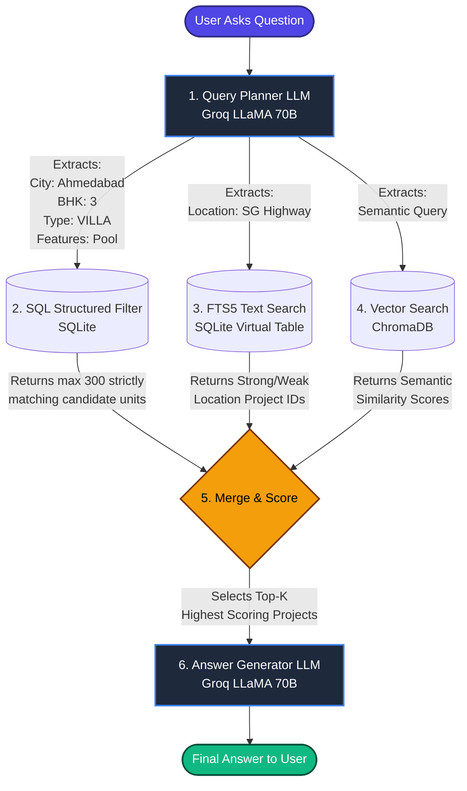

# ReraChat Architecture & Scale Handling Pipeline

This document explains the architecture and approach used by the ReraChat system to efficiently handle massive datasets (e.g., 20,000+ project brochures) without degrading performance, hitting LLM context limits, or sacrificing search accuracy.

## 1. The Core Philosophy for Scale
When scaling from 20 brochures to 20,000 brochures, it becomes impossible to feed all data directly into a large language model (LLM). Instead, the system uses a **Retrieval-Augmented Generation (RAG)** approach optimized with **multi-tiered filtering**. 

The LLM is only used at the very beginning (to understand the user's intent) and at the very end (to format the final answer). The "heavy lifting" of searching through 20,000 projects happens in blindingly fast database layers (SQLite SQL, SQLite FTS5, and ChromaDB).

---

## 2. The Data Ingestion Pipeline (Handling 20,000 Files)

To process 20,000 JSON or PDF brochures in a reasonable time, the system cannot process them sequentially. 

**How it works at scale:**
- **Parallel Processing:** During ingestion, the system uses thread pools to process multiple brochures concurrently.
- **Relational Splitting:** Instead of storing massive JSON blobs, the data is split into highly optimized SQLite tables (`projects`, `units`, `rooms`, `project_landmarks`, `project_amenities`).
- **Precomputed Flags:** Properties like "has a clubhouse" or "has a pooja room" are converted from text into `INTEGER DEFAULT 0` (boolean) flags during ingestion. Checking `has_pooja_room = 1` across 20,000 rows takes less than a millisecond in SQL.

---

## 3. The Search & Query Pipeline (Step-by-Step)

When a user asks a question (e.g., *"3 BHK villa in Ahmedabad near SG Highway with a pool"*), the system executes a highly optimized pipeline.

### Pipeline Diagram
*Note: This Mermaid diagram renders as a high-quality visual graph.*

### Deep Dive into the Search Stages

#### Stage 1: Query Planning (LLM)
Instead of feeding the user's raw text to the database, Groq (LLaMA 70B) converts the natural language into a structured SearchPlan JSON object. 
- **Why for scale?** Humans ask messy questions. By distilling the intent into exact structured filters (City, BHK, Property Type, Amenities), we can drastically reduce the search space in the next step.

#### Stage 2: SQL Structured Filtering (The Big Funnel)
The system executes a SQL query on the SQLite database using the extracted parameters.
- **Why for scale?** SQL databases are built to filter millions of rows instantly. By using composite indexes (`idx_projects_city`, `idx_units_bhk_type`) and applying exact matches (e.g., `WHERE u.bhk = 3 AND p.city = 'ahmedabad' AND p.has_pool = 1`), the system immediately discards 19,900 irrelevant brochures.

**What are Composite Indexes?**
An index in a database is like the index at the back of a textbook—it tells the database exactly where to find data without having to read the whole book. A **composite index** is a special index built on *multiple columns at the same time*. 
For example, instead of finding all "3 BHK" units, and then separately finding all "Villas", and then checking where they overlap, the composite index `idx_units_bhk_type` pre-sorts and groups data by both metrics simultaneously (e.g., all "3 BHK Villas" are stored together in one tidy block). When the SQL query asks for a 3 BHK Villa, the database jumps straight to that exact block and ignores the rest of the database completely, saving massive amounts of processing time.

- **Candidate Limit:** The SQL query has a strict `LIMIT 300` and an `ORDER BY` clause. Even if 5,000 projects match, we only evaluate the absolute best 300 candidates to keep Memory and CPU usage flat, regardless of total DB size.

#### Stage 3: FTS5 Full-Text Search (Tiered Location Matching)
A dedicated Full-Text Search (FTS5) SQLite virtual table handles string matching for things like neighbourhood names, addresses, landmarks, and amenity lists. 

**What is FTS5?**
FTS5 is an SQLite virtual table module designed specifically for extremely fast text searching across entire documents. Instead of scanning row by row like a normal database search (`LIKE %word%`), FTS5 creates an **inverted index**. This means it pre-builds a dictionary of every single word in the database and records exactly which rows contain that word.

- **Why for scale?** Standard `LIKE %word%` searches slow down exponentially as the database grows because they have to scan every character of every row. With the inverted index of FTS5, searching for a word like "SG Highway" across 20,000 documents takes roughly the same near-instantaneous time as searching across 20 documents.
- **Tiered Approach:** It divides results into **Strong Matches** (the project address is ON SG Highway) and **Weak Matches** (the project's landmark list mentions SG Highway).

#### Stage 4: ChromaDB Vector Semantic Search
Used for fuzzy matching on unit descriptions.
- **Why for scale?** We pre-filter the ChromaDB query using metadata (`$eq: {"city": "ahmedabad"}`). This means ChromaDB doesn't have to calculate vector distances against all 20,000 embeddings—only the ones in the isolated city/BHK pool.

#### Stage 5: Merge, Score & Group
The system assigns a weighted mathematical score to every candidate:
- *SQL Match:* +0.4 points
- *Strong Location Match:* +0.4 points
- *FTS Text Match:* +0.3 points
- *Vector Match:* up to +0.5 points

It then groups matching units back into their parent projects and sorts them by highest score. It drops all but the **Top K** (usually top 5) projects.
- **Why for scale?** No matter how large the database is, only a maximum of 5 highly relevant, perfectly matching projects proceed to the final step.

#### Stage 6: Answer Generation (LLM)
The LLM (Groq LLaMA 70B) is provided with the user's origin query and the JSON dump of ONLY the top 1 to 5 resulting projects. It then writes a natural, conversational response.
- **Why for scale?** LLMs have a strict "Context Window" limit (number of tokens they can read). If we tried to pass 20,000 brochures, or even 50 brochures, the LLM would crash or hallucinate. By aggressively filtering the data down to just the top 5 matches beforehand, the LLM prompt remains small, lightning-fast, highly accurate, and impervious to scale.

---

## Conclusion
This pipeline guarantees `O(1)` or near-constant time complexity for the LLM stages, and `O(log N)` logarithmic time complexity for the database stages. Whether the system contains 20 brochures or 20,000 brochures, query response times will remain blazing fast (typically under 2-3 seconds) and immune to LLM hallucination limits.
